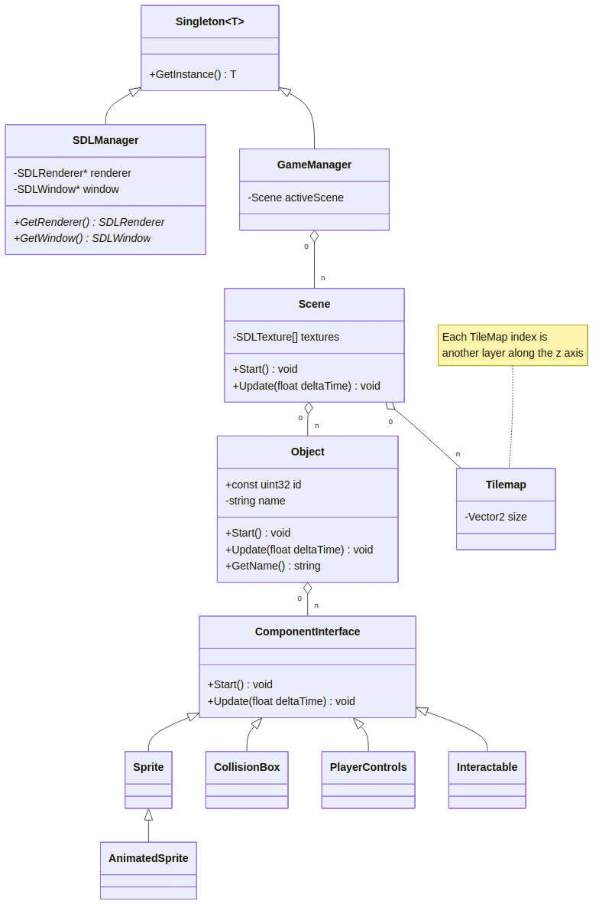

# 2D SDL2 Engine

A work in progress data driven 2D game engine utilizing SDL2. Currently in the design phase with these goals in mind:
- Live refreshable data
- Component based functionality
- Deterministic

# Design

The design is currrently a work-in-progress, automatically updated here.
